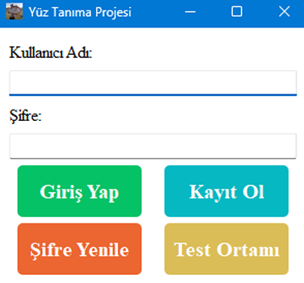
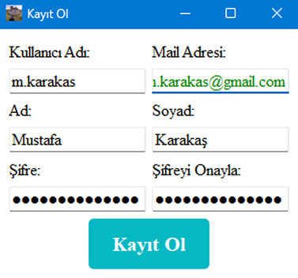
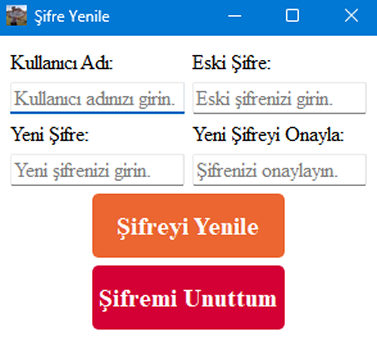
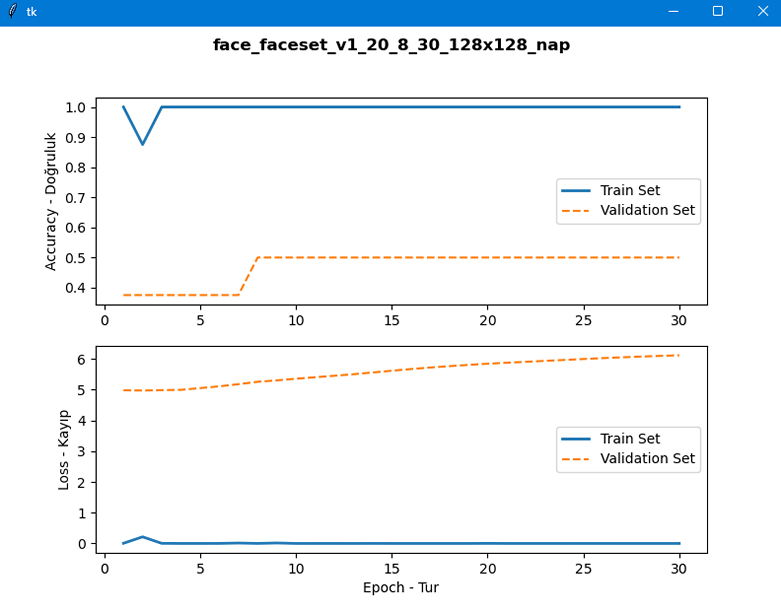

# Face-Recognition by Mustafa Karakaş

## GUI Ekran Görüntüleri

| Giriş Ekranı                               | Kayıt Ekranı                                  |
|--------------------------------------------|-----------------------------------------------|
|  |  |

| Şifre Yenile                                   | Şifre Sıfırla                                  |
|------------------------------------------------|------------------------------------------------|
|  |  |

| Ana Ekran                                       | Veri Ekle                                    |
|-------------------------------------------------|----------------------------------------------|
|  |  |

| Veri Sil                                        | Veri Bilgisi                                  |
|-------------------------------------------------|-----------------------------------------------|
|  |  |

| Model Eğitimi                                   | Model Sil                                        |
|-------------------------------------------------|--------------------------------------------------|
|  |  |

| Model Bilgisi                                  | 
|------------------------------------------------|
|  |

| Model Bilgi Grafiği                        | 
|--------------------------------------------|
|  |

| Test Web                                     | Yerel Klasör Dosya Seçimi                        |
|----------------------------------------------|--------------------------------------------------|
|  |  |

| Test Url Image                                                                                            | Test Url Youtube                                                                                         |
|-----------------------------------------------------------------------------------------------------------|----------------------------------------------------------------------------------------------------------|
|   |    |

### Model isimlendirmesi:

| Veriseti Türü | Veriseti Adı | Veriseti Versiyonu | Veri Çeşit Sayısı | Batch Boyutu | Epoch Sayısı | Girdi Boyutu (GxY) | 3 Karakterli Rastgele Dize | Model Uzantısı | Elde Edilen Model İsmi                 |
|---------------|--------------|--------------------|-------------------|--------------|--------------|--------------------|----------------------------|----------------|----------------------------------------|
| face          | faceset      | v1                 | 20                | 8            | 30           | 128x128            | nap                        | .h5            | face_faceset_v1_20_8_30_128x128_nap.h5 |
| face          | faceset      | v1                 | 20                | 32           | 3            | 128x128            | tga                        | .h5            | face_faceset_v1_20_32_3_128x128_tga.h5 |
| face          | faceset      | v1                 | 20                | 8            | 2            | 128x128            | wep                        | .h5            | face_faceset_v1_20_8_2_128x128_wep.h5  |

- 'admin' kullanıcı adı, şifre : admin123, admin123
- Roller : ADMIN, USER, None