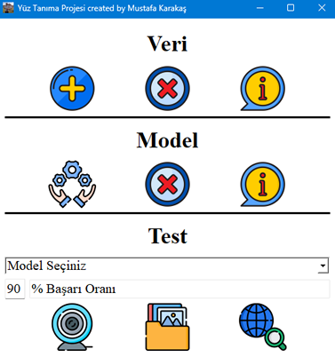
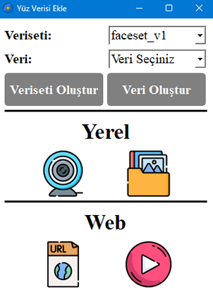
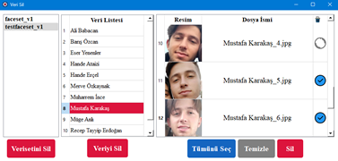
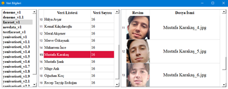
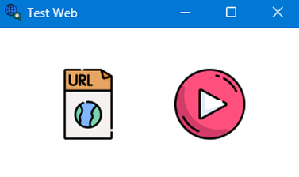
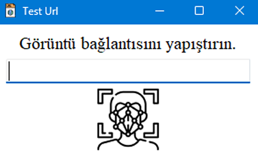
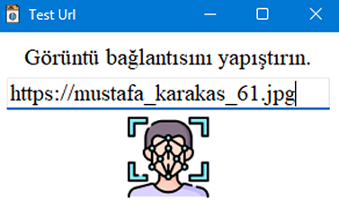
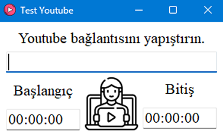
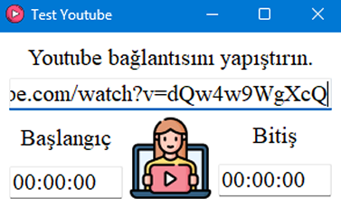

# Face-Recognition by Mustafa Karakaş

## GUI Ekran Görüntüleri

| Ana Ekran                                                                                                                                                                                               | Veri Ekle                                                                                                                                                                                             |
|---------------------------------------------------------------------------------------------------------------------------------------------------------------------------------------------------------|-------------------------------------------------------------------------------------------------------------------------------------------------------------------------------------------------------|
|  |  |

| Veri Sil                                                                                                                                                                                                   |  Veri Bilgisi                                                                                                                                                                                          |
|------------------------------------------------------------------------------------------------------------------------------------------------------------------------------------------------------------|--------------------------------------------------------------------------------------------------------------------------------------------------------------------------------------------------------|
|  |  |

| Model Eğitimi                                                                                                                                                                                              | Model Sil                                                                                                                                                                                                    |
|------------------------------------------------------------------------------------------------------------------------------------------------------------------------------------------------------------|--------------------------------------------------------------------------------------------------------------------------------------------------------------------------------------------------------------|
|  |  |

| Model Bilgisi                                                                                                                                                                                            | 
|----------------------------------------------------------------------------------------------------------------------------------------------------------------------------------------------------------|
|  |

| Test Web                                                                                                                                                                                             | Yerel Klasör Dosya Seçimi                                                                                                                                                                                    |
|------------------------------------------------------------------------------------------------------------------------------------------------------------------------------------------------------|--------------------------------------------------------------------------------------------------------------------------------------------------------------------------------------------------------------|
|  |  |

| Test Url Image                                                                                                                                                                                                                                                                                                                                                                                                                        | Test Url Youtube                                                                                                                                                                                                                                                                                                                                                                                                                   |
|---------------------------------------------------------------------------------------------------------------------------------------------------------------------------------------------------------------------------------------------------------------------------------------------------------------------------------------------------------------------------------------------------------------------------------------|------------------------------------------------------------------------------------------------------------------------------------------------------------------------------------------------------------------------------------------------------------------------------------------------------------------------------------------------------------------------------------------------------------------------------------|
|   |    |

### Model isimlendirmesi:

| Veriseti Türü | Veriseti Adı | Veriseti Versiyonu | Veri Çeşit Sayısı | Batch Boyutu | Epoch Sayısı | Girdi Boyutu (GxY) | 3 Karakterli Rastgele Dize | Model Uzantısı | Elde Edilen Model İsmi                 |
|---------------|--------------|--------------------|-------------------|--------------|--------------|--------------------|----------------------------|----------------|----------------------------------------|
| face          | faceset      | v1                 | 20                | 8            | 30           | 128x128            | nap                        | .h5            | face_faceset_v1_20_8_30_128x128_nap.h5 |
| face          | faceset      | v1                 | 20                | 32           | 3            | 128x128            | tga                        | .h5            | face_faceset_v1_20_32_3_128x128_tga.h5 |
| face          | faceset      | v1                 | 20                | 8            | 2            | 128x128            | wep                        | .h5            | face_faceset_v1_20_8_2_128x128_wep.h5  |

- 'admin' username, password : admin123, admin123
- Roller : ADMIN, USER, None