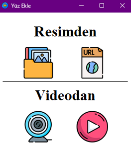
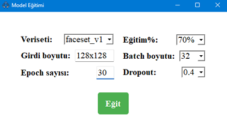
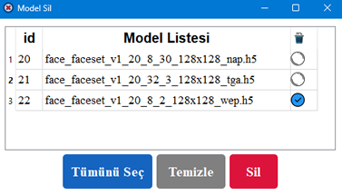
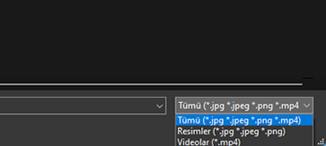
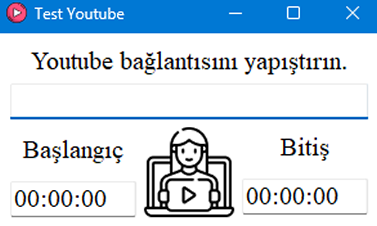

# Face-Recognition by Mustafa Karakaş

## GUI Ekran Görüntüleri

| Ana Ekran                               | Yüz Ekle                              |
|-----------------------------------------|---------------------------------------|
|  |   |

| Model Eğitimi | Model Sil       |
|---------------|-----------------|
|   |   |

| Test Web                              | Yerel Klasör Dosya Seçimi                |
|---------------------------------------|------------------------------------------|
|   |  |

| Test Url Image                                                                            | Test Url Youtube                                                                         |
|-------------------------------------------------------------------------------------------|------------------------------------------------------------------------------------------|
|   |    |

### Model isimlendirmesi:

| Veriseti Türü | Veriseti Adı | Veriseti Versiyonu | Veri Çeşit Sayısı | Batch Boyutu | Epoch Sayısı | Girdi Boyutu (GxY) | 3 Karakterli Rastgele Dize | Model Uzantısı | Elde Edilen Model İsmi                  |
|---------------|--------------|--------------------|-------------------|--------------|--------------|--------------------|----------------------------|----------------|-----------------------------------------|
| face          | faceset      | v1                 | 20                | 32           | 50           | 128x128            | dvy                        | .h5            | face_faceset_v1_20_32_50_128x128_dvy.h5 |
| face          | faceset      | v1                 | 20                | 8            | 30           | 128x128            | esy                        | .h5            | face_faceset_v1_20_8_30_128x128_esy.h5  |